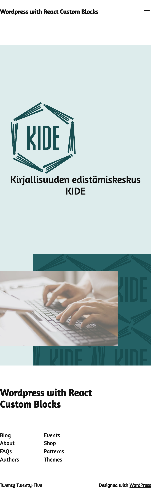

# Kide Custome Made Hero Block witrh React in WordPress

A custom WordPress Gutenberg block plugin that adds a Hero section to your site.  
Perfect for showcasing featured content, images, and calls-to-action.

## Screenshot

## Features

- Custom Hero block for Gutenberg editor
- Fully responsive
- Supports custom images, titles, and buttons
- Built with modern JavaScript (React) and PHP

## Installation

1. Download or clone this repository.
2. Copy the `hero-block` folder into your WordPress `wp-content/plugins` directory.
3. Activate the plugin in the WordPress Admin → Plugins menu.
4. Add the Hero block in the Gutenberg editor to your pages.

## Usage

- Use the block in the Gutenberg editor.
- Customize the content, images, and buttons according to your design.

## License

This project is licensed under the MIT License.
